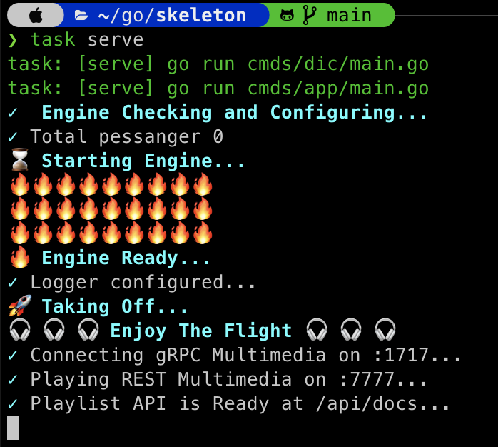
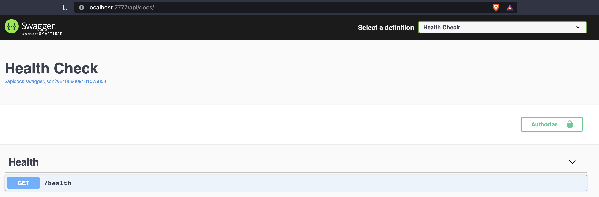
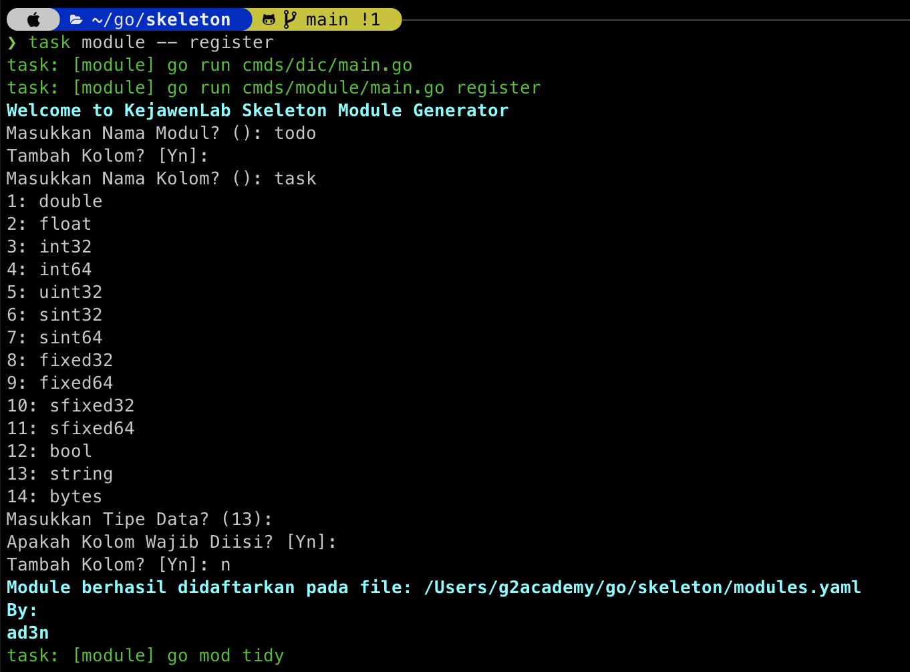
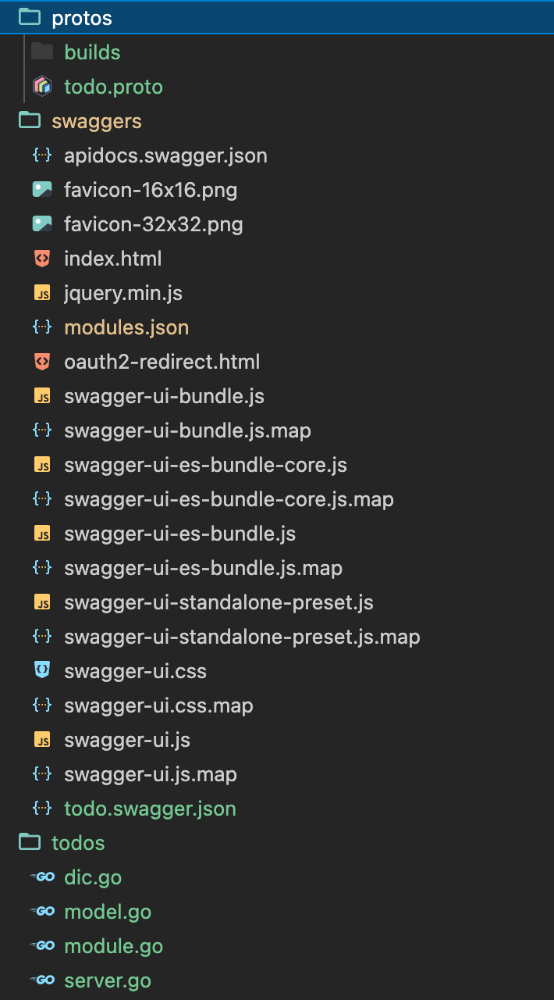

## Skeleton

Skeleton is a boilerplate, RESTful generator based on [Bima](https://github.com/KejawenLab/bima)

### Video

Check the [video](https://www.youtube.com/watch?v=zZPpDizZGIM)

### Requirements

- Go 1.16 or above

- Git

- [Taskfile](taskfile.dev)

- [gRPC Gateway](https://github.com/grpc-ecosystem/grpc-gateway)

- RDBMS (by default only supports `mysql` and `postgresql`) or MongoDB for database storage

- Elasticsearch (Optional)

- RabbitMQ (Optional)

### Basic Usage

- Download using skeleton using git by running `git clone https://github.com/KejawenLab/skeleton.git`

- Download dependencies using `task clean` command

- Create `bima_skeleton` database

- Copy `env.example` to `.env` and changes `DB_DRIVER`, `DB_HOST`, `DB_PORT`, `DB_NAME`, `DB_USER`, and `DB_PASSWORD` values

- Run using `task run`



- Open your browser and open `http://localhost:7777` or port assigned by you



### Create New Module

- Run `task module -- add <name>`

- Follow the instructions 



- Bima will generate `todos` folder as your module space, creating `protos/todo.proto`, register your module in `configs/modules.yaml` and register your Dependency Injection defined in `dic.go` to `configs/provider.go`



- Run `task run` and refresh your browser


### Register Request Filter

Try to call `/api/v1/todos?fields=task&values=xxx` and do not effect like below 


Because by default skeleton doesn't provide filter. To apply request filter, you need to register your own filter or just use filter that provided by bima.

First, i imagine you are use `mysql` or `postgresql` as driver, you need to add code below into your `todos/dic.go`

```go
// import "github.com/KejawenLab/bima/v3/listeners/paginations"
{
    Name:  "bima:listener:filter:gorm",
    Build: (*paginations.GormFilter)(nil),
}
```

Then you need to register the `bima:listener:filter:gorm` to your `configs/listeners.yaml`

```yaml
listeners:
    - filter:gorm # `bima:listener:` prefix is reserved by skeleton 
```

Now, you can rerun using `task run` and try `/api/v1/todos?fields=task&values=xxx` and then the result like below


