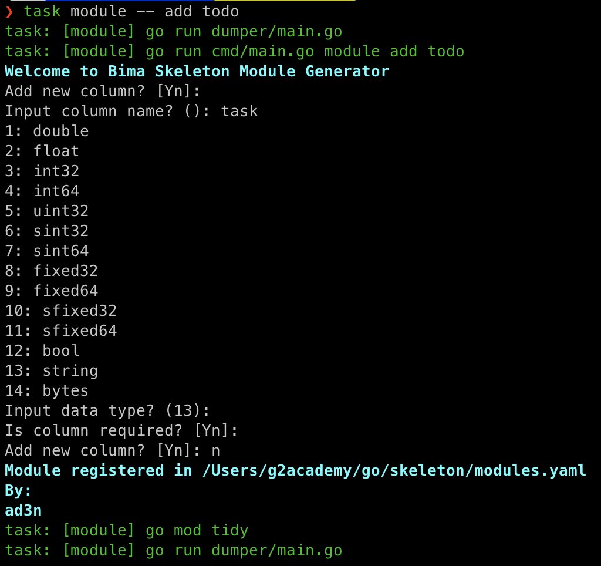
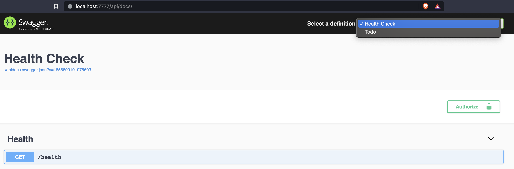
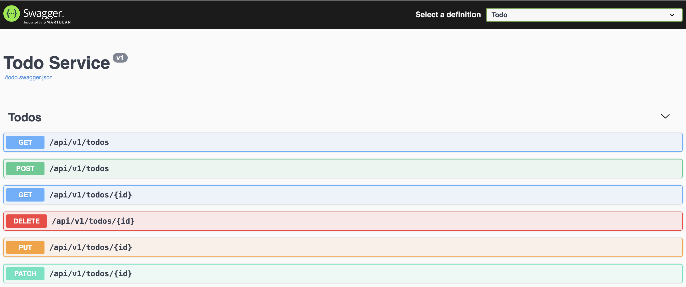
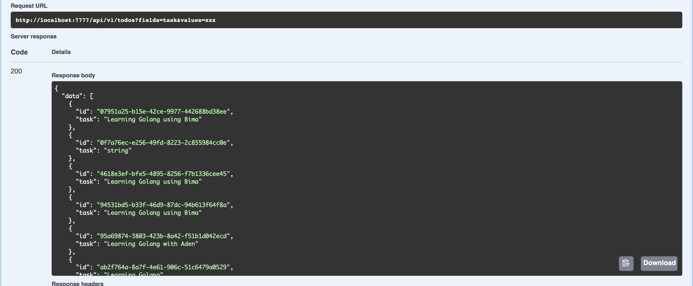
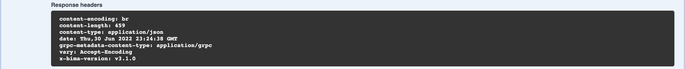
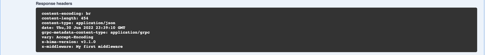
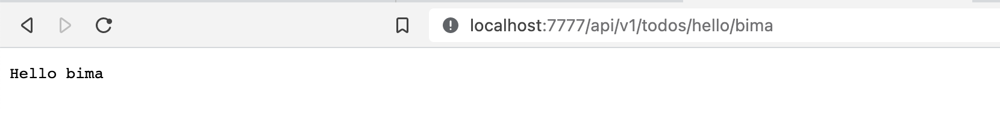
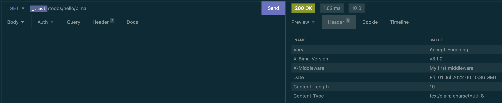
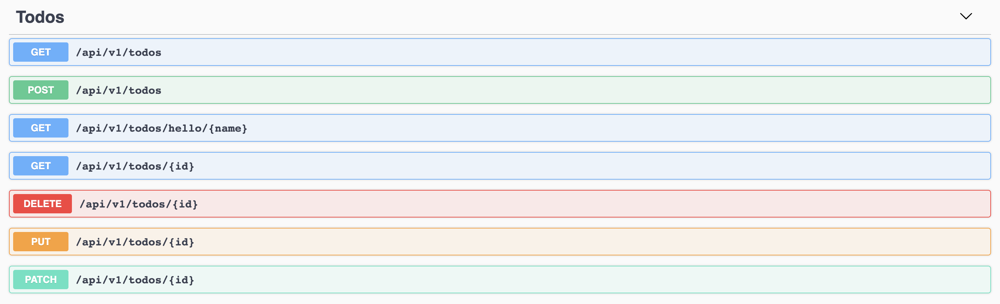

## Skeleton

Skeleton is a boilerplate, RESTful generator based on [Bima](https://github.com/KejawenLab/bima)

### Video

Check the [video](https://www.youtube.com/watch?v=zZPpDizZGIM)

### Requirements

- Go 1.16 or above

- Git

- [Taskfile](taskfile.dev)

- [gRPC Gateway](https://github.com/grpc-ecosystem/grpc-gateway)

- RDBMS (by default only supports `mysql` and `postgresql`) or MongoDB for database storage

- Elasticsearch (Optional)

- RabbitMQ (Optional)

### Basic Usage

- Download using skeleton using git by running `git clone https://github.com/KejawenLab/skeleton.git`

- Download dependencies using `task clean` command

- Create `bima_skeleton` database

- Copy `env.example` to `.env` and changes `DB_DRIVER`, `DB_HOST`, `DB_PORT`, `DB_NAME`, `DB_USER`, and `DB_PASSWORD` values

- Run using `task run`


- Open your browser and open `http://localhost:7777` or port assigned by you


### Create New Module

- Run `task module -- add <name>`

- Follow the instructions 



- Bima will generate `todos` folder as your module space, creating `protos/todo.proto`, register your module in `configs/modules.yaml` and register your Dependency Injection defined in `dic.go` into `configs/provider.go`


- Run `task run` and refresh your browser





### Register Request Filter

Try to call `/api/v1/todos?fields=task&values=xxx` and do not effect like below 




Because by default skeleton doesn't provide filter. To apply request filter, you need to register your own filter or just use filter that provided by bima.

First, i imagine you are use `mysql` or `postgresql` as driver, you need to add code below into your `todos/dic.go`

```go
// import "github.com/KejawenLab/bima/v3/listeners/paginations"
{
    Name:  "bima:listener:filter:gorm",
    Build: (*paginations.GormFilter)(nil),
}
```

Then you need to register the `bima:listener:filter:gorm` to your `configs/listeners.yaml`

```yaml
listeners:
    - filter:gorm # `bima:listener:` prefix is reserved by skeleton 
```

Now, you can rerun using `task run` and try `/api/v1/todos?fields=task&values=xxx` and then the result like below


You can easy to create your own filter by implement `Listener` interface

```go
Listener interface {
    Handle(event interface{}) interface{}
    Listen() string
    Priority() int
}
```

The available events are below

```go
PaginationEvent   = Event("pagination")
BeforeCreateEvent = Event("before_create")
BeforeUpdateEvent = Event("before_update")
BeforeDeleteEvent = Event("before_delete")
AfterCreateEvent  = Event("after_create")
AfterUpdateEvent  = Event("after_update")
AfterDeleteEvent  = Event("after_delete")
```

You can refer default listeners in [listeners](https://github.com/KejawenLab/bima/tree/main/listeners) for example

### Your first middleware

When you call `/api/v1/todos` you get response header like below



For example, you want to add `X-Middleware` to your response header, first step, create file `middleware.go` in your `todos` folder and paste codes below

```go
package todos

import (
	"net/http"
)

type Middleware struct {
}

func (a *Middleware) Attach(_ *http.Request, response http.ResponseWriter) bool {
	response.Header().Add("X-Middleware", "My first middleware")

	return false
}

func (a *Middleware) Priority() int {
	return 0
}

```

And then, register your middleware into `todos/dic.go`

```go
{
    Name:  "bima:middleware:todo",
    Build: (*Middleware)(nil),
}

```

Last, register your middleware to `configs/middlewares.yaml`

```yaml
middlewares:
    - todo

```

Now, you can rerun using `task run` and try `/api/v1/todos` and then the result like below



Very easy, right? You can create anything by implement `Middleware` interface below

```go
Middleware interface {
    Attach(request *http.Request, response http.ResponseWriter) bool
    Priority() int
}
```

### Add new route

For example, you want to add new page `/api/v1/todos/hello/{name}` that response `Hello <name>` string, first add `route.go` to your `todos` folder

```go
package todos

import (
	"bytes"
	"net/http"

	"github.com/KejawenLab/bima/v3/middlewares"
	"google.golang.org/grpc"
)

type HelloWorld struct {
}

func (a *HelloWorld) Path() string {
	return "/api/v1/todos/hello/{name}"
}

func (a *HelloWorld) Method() string {
	return http.MethodGet
}

func (a *HelloWorld) SetClient(client *grpc.ClientConn) {}

func (a *HelloWorld) Middlewares() []middlewares.Middleware {
	return nil
}

func (a *HelloWorld) Handle(w http.ResponseWriter, r *http.Request, params map[string]string) {
	w.Write([]byte("Hello " + params["name"]))
}

```

And then, register your middleware into `todos/dic.go`

```go
{
    Name:  "bima:route:hello",
    Build: (*HelloWorld)(nil),
}

```

Last, register your middleware to `configs/routes.yaml`


```yaml
routes:
    - hello

```

Rerun using `task run` and open `/api/v1/todos/hello/bima` and then the result like below



Now, try to remove `todo` from `configs/middlewares.yaml` so your response header will be back like below


And then change your `route.go` to

```go
func (a *HelloWorld) Middlewares() []middlewares.Middleware {
	return []middlewares.Middleware{&Middleware{}}
}
```

Rerun again and open `/api/v1/todos/hello/bima` and your middleware is there



But when you open `/api/v1/todos` or any page others, your middleware is not exists. Yes, your can also add middleware for specific route with easy.

### Add new route to swagger

By default, your custom route is not automatically added to swagger, you need to add manually. Open `todo.swagger.json` in `swaggers` folder using [Swagger Editor](https://editor.swagger.io) add this lines

```json
"/api/v1/todos/hello/{name}": {
    "get": {
    "operationId": "Todos_Hello_World",
    "responses": {
        "200": {
        "description": "A successful response.",
            "schema": {
                "type": "string"
            }
        },
        "default": {
            "description": "An unexpected error response.",
            "schema": {
                "$ref": "#/definitions/rpcStatus"
            }
        }
    },
    "parameters": [
        {
            "name": "name",
            "in": "path",
            "required": true,
            "type": "string"
        }
    ],
    "tags": [
            "Todos"
        ]
    }
}
```

Rerun again and open `/api/docs` and your custom route is already there


