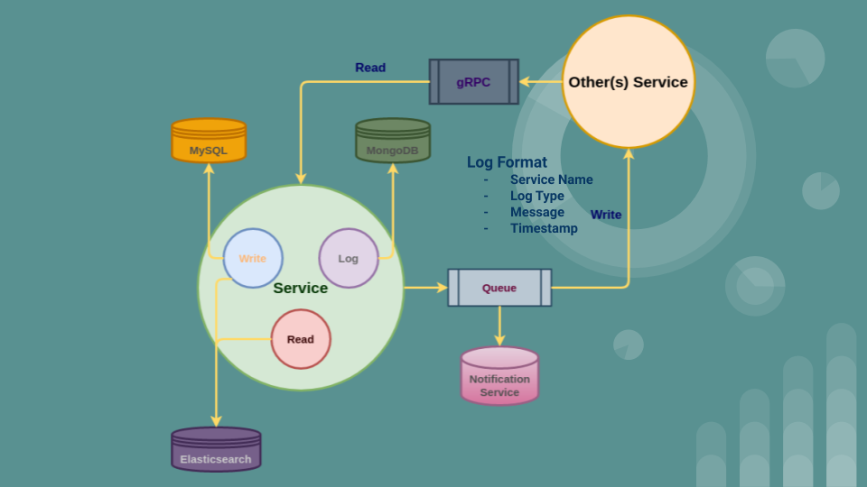
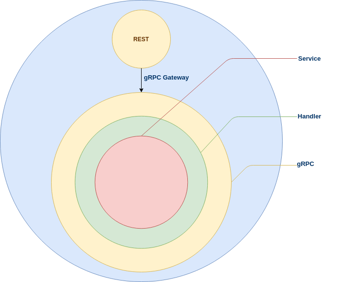
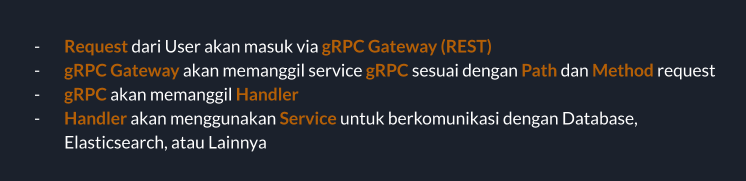
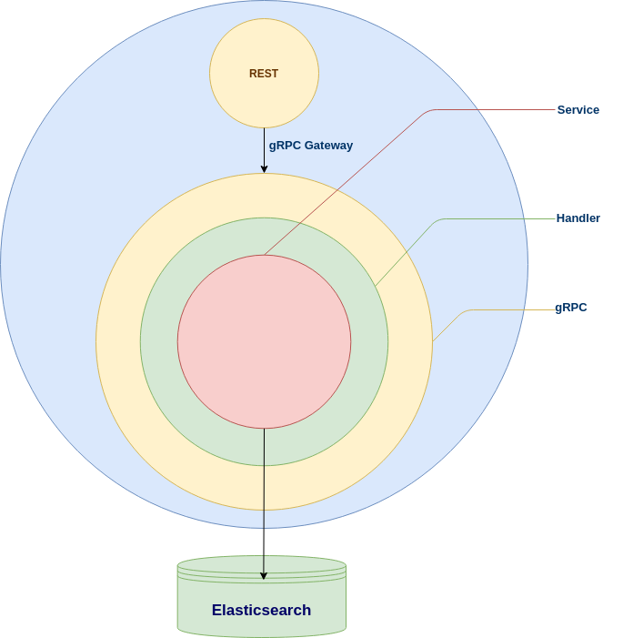
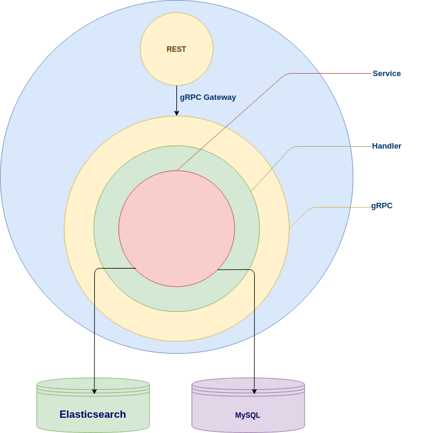
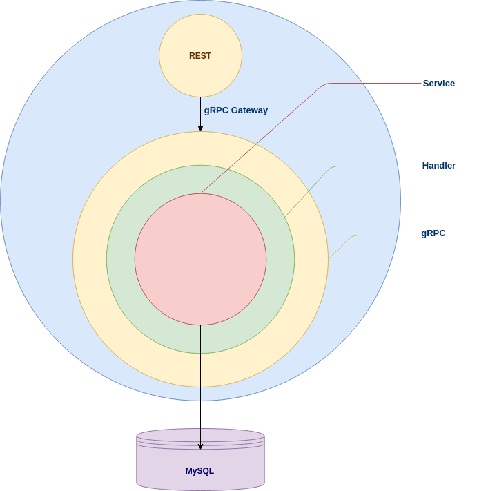

## Master Service

## Architecture



## Request Flow





## Flow Pagination



## Flow Create/Update/Delete



## Flow Get



## Tools

Saat ini masih menggunakan protoc-gen-go versi yang lama (v1.4.3)

```
$ go install \
    github.com/grpc-ecosystem/grpc-gateway/v2/protoc-gen-grpc-gateway \
    github.com/grpc-ecosystem/grpc-gateway/v2/protoc-gen-openapiv2 \
    github.com/golang/protobuf/protoc-gen-go
```

## Run

- Build Dependency Graph

```
go run cmd/dic/main.go
```

- Elasticsearch Dump

```
go run cmd/elasticsearch/main.go
```

- Application

```
go run cmd/app/main.go
```

## Testing

```
$ go test ./... [-v]
```
