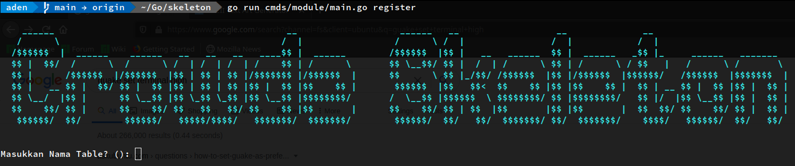
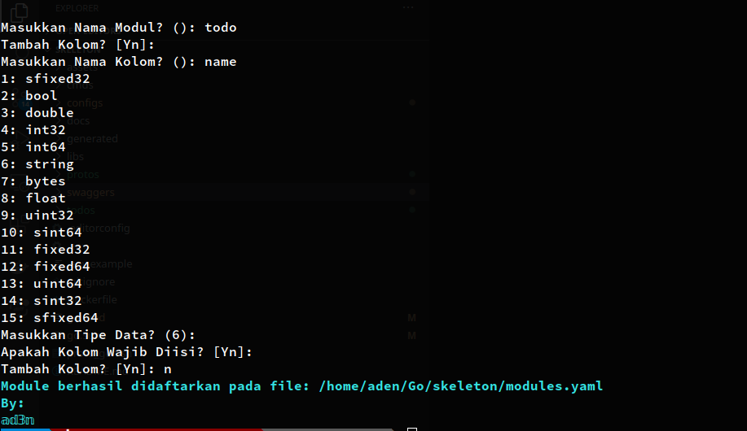
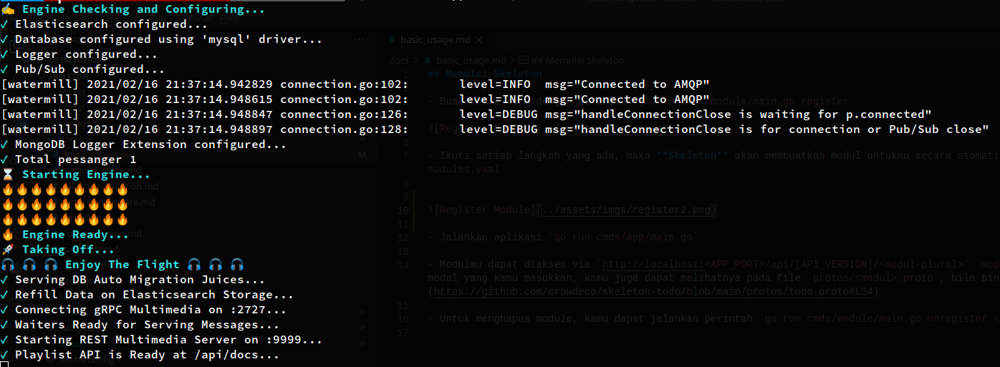
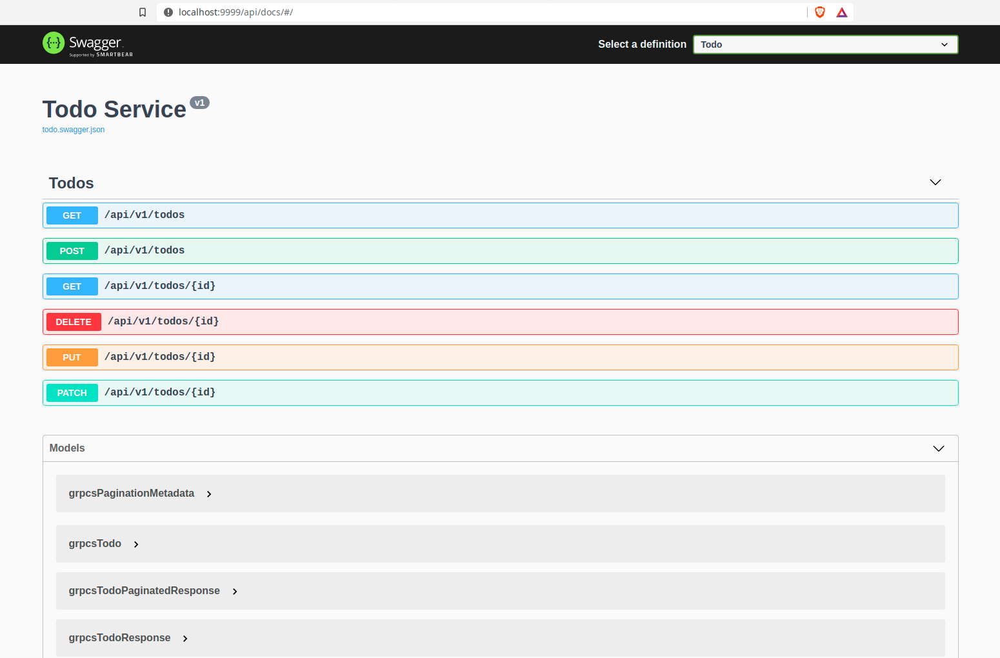

## Memulai Skeleton

- Pastikan DI Container terupdate `go run cmds/dic/main.go`

- Buat modul baru dengan perintah `go run cmds/module/main.go register`

- Ikuti setiap langkah yang ada, maka **Skeleton** akan membuatkan modul untukmu secara otomatis dan menambahkan modulmu pada file `configs/modules.yaml`

- Jalankan aplikasi `go run cmds/app/main.go`

Dan bila kamu membuka halaman Dokumentasi Api maka tampilannya adalah sebagai berikut:

- Modulmu dapat diakses via `http://localhost:<APP_PORT>/api/[API_VERSION]/<modul-plural>` `modul-plural` adalah bentuk plural dari nama modul yang kamu masukkan, kamu juga dapat melihatnya pada file `protos/<modul>.proto`, bila bingung, bisa melihat contoh pada [skeleton-todo](https://github.com/crowdeco/skeleton-todo/blob/main/protos/todo.proto#L34)

- Untuk menghapus module, kamu dapat jalankan perintah `go run cmds/module/main.go unregister <modul>`
