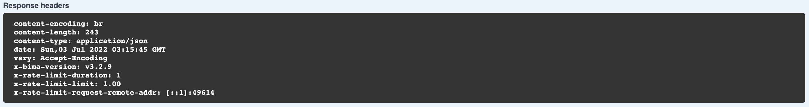

# Convert Middleware

For this example, i use `https://github.com/didip/tollbooth`

- Create `rate_limit.go` inside `middlewares` folder (you can create when folder not exists)

- Copas placeholder code

```go
package middlewares

import (
	"net/http"
)

type RateLimit struct {
}

func (r *RateLimit) Attach(request *http.Request, response http.ResponseWriter) bool {
}

func (r *RateLimit) Priority() int {
	return 0
}

```

- Look up to the handler function

From readme, we know when we want to use `https://github.com/didip/tollbooth`, we just add one line like below

```go
tollbooth.LimitFuncHandler(tollbooth.NewLimiter(1, nil), HelloHandler)
```

See inside `tollbooth.LimitFuncHandler()` and here the code

```go
middle := func(w http.ResponseWriter, r *http.Request) {
    httpError := LimitByRequest(lmt, w, r)
    if httpError != nil {
        lmt.ExecOnLimitReached(w, r)
        if lmt.GetOverrideDefaultResponseWriter() {
            return
        }
        w.Header().Add("Content-Type", lmt.GetMessageContentType())
        w.WriteHeader(httpError.StatusCode)
        w.Write([]byte(httpError.Message))
        return
    }

    // There's no rate-limit error, serve the next handler.
    next.ServeHTTP(w, r)
}

return http.HandlerFunc(middle)
```

- Find `func(w http.ResponseWriter, r *http.Request)` function and copas the body to your middleware, like below (i change variable names)

```go
limiter := tollbooth.NewLimiter(1, nil)
httpError := tollbooth.LimitByRequest(limiter, response, request)
if httpError != nil {
    limiter.ExecOnLimitReached(response, request)
    if limiter.GetOverrideDefaultResponseWriter() {
        return true
    }

    response.Header().Add("Content-Type", limiter.GetMessageContentType())
    response.WriteHeader(httpError.StatusCode)
    response.Write([]byte(httpError.Message))

    return true
}

return false
```

Here full code

```go
package middlewares

import (
	"net/http"

	"github.com/didip/tollbooth/v6"
)

type RateLimit struct {
}

func (r *RateLimit) Attach(request *http.Request, response http.ResponseWriter) bool {
	limiter := tollbooth.NewLimiter(1, nil)
	httpError := tollbooth.LimitByRequest(limiter, response, request)
	if httpError != nil {
		limiter.ExecOnLimitReached(response, request)
		if limiter.GetOverrideDefaultResponseWriter() {
			return true
		}

		response.Header().Add("Content-Type", limiter.GetMessageContentType())
		response.WriteHeader(httpError.StatusCode)
		response.Write([]byte(httpError.Message))

		return true
	}

	return false
}

func (r *RateLimit) Priority() int {
	return 0
}

```

- Add definition to `dics/container.go`

```go
{
    Name:  "bima:middleware:rate-limiter",
    Build: (*middlewares.RateLimit)(nil),
}
```

- Add to `configs/middlewares.yaml`

```yaml
middlewares:
    - rate-limiter
```

- Add `max` value optional

```go
type RateLimit struct {
	Max float64
}

func (r *RateLimit) Attach(request *http.Request, response http.ResponseWriter) bool {
	limiter := tollbooth.NewLimiter(r.Max, nil)
	httpError := tollbooth.LimitByRequest(limiter, response, request)
	if httpError != nil {
		limiter.ExecOnLimitReached(response, request)
		if limiter.GetOverrideDefaultResponseWriter() {
			return true
		}

		response.Header().Add("Content-Type", limiter.GetMessageContentType())
		response.WriteHeader(httpError.StatusCode)
		response.Write([]byte(httpError.Message))

		return true
	}

	return false
}
```

- Change definition

```go
{
    Name:  "bima:middleware:rate-limiter",
    Build: (*middlewares.RateLimit)(nil),
    Params: dingo.Params{
        "Max": float64(1),
    },
}
```


