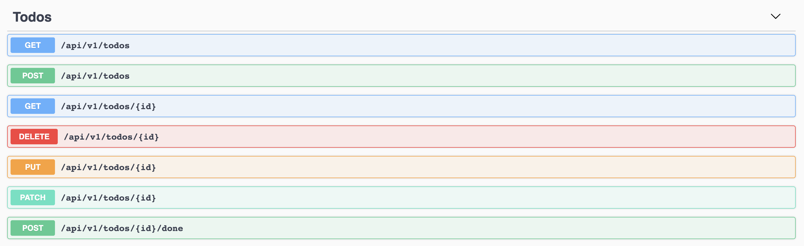
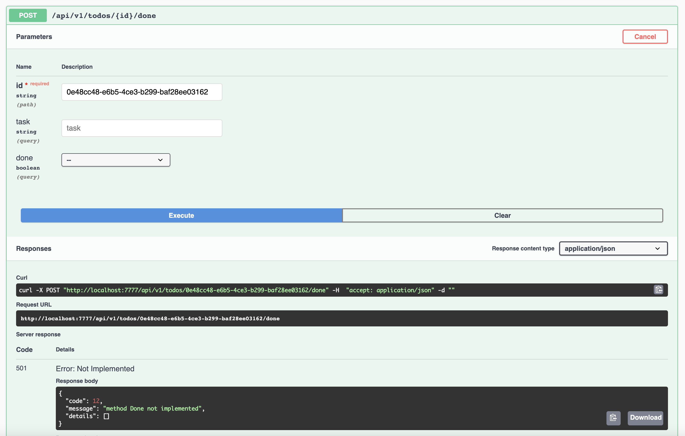
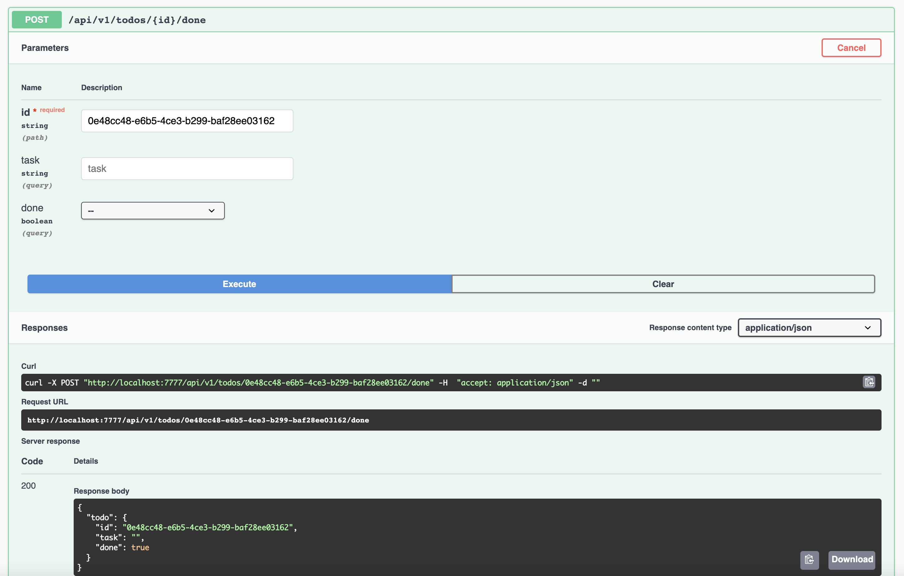

# Add Custom Action

This tutorial will explain how to add custom action (service) to your gRPC (proto)

- Add new service

```proto
....
rpc Done (Todo) returns (TodoResponse) {
    option (google.api.http) = {
        post: "/api/v1/todos/{id}/done"
    };
}
....
```

We add new `Done` service with `/api/v1/todos/{id}/done` as path and use `POST` HTTP method

- Update generated code using `task generate` and refresh your browser





- Implement `Done` service

```go
func (m *Module) Done(ctx context.Context, r *grpcs.Todo) (*grpcs.TodoResponse, error) {
	ctx = context.WithValue(ctx, "scope", "todo")
	v := m.Model
	copier.Copy(v, r)
	if err := m.Handler.Bind(v, r.Id); err != nil {
		loggers.Logger.Error(ctx, err.Error())

		return nil, status.Error(codes.NotFound, fmt.Sprintf("Data with ID '%s' not found.", r.Id))
	}

	v.Done = true
	if err := m.Handler.Update(v, v.Id); err != nil {
		loggers.Logger.Error(ctx, err.Error())

		return nil, status.Error(codes.Internal, "Internal server error")
	}

    r.Done = v.Done
	m.Cache.Invalidate(r.Id)

	return &grpcs.TodoResponse{
		Todo: r,
	}, nil
}

```

- Rerun and recall your new action



