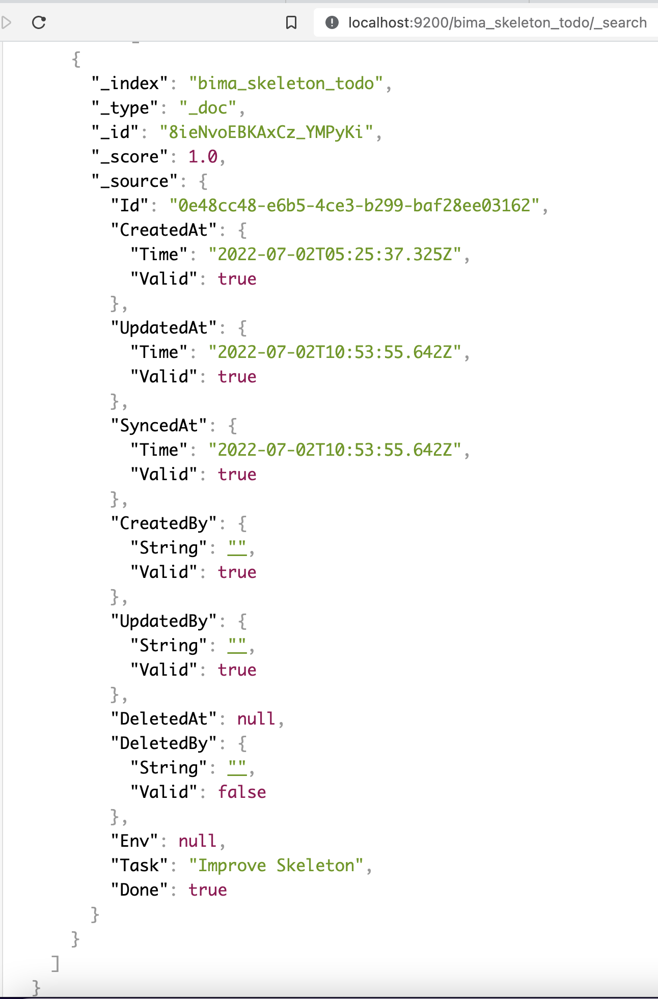

# Sync to Elasticsearch

## Populate Data to Elasticsearch

- Make sure `ELASTICSEARCH_HOST`, `ELASTICSEARCH_PORT` is defined in `.env`

- You must use `mysql` or `postgresql` as driver

- Override `Sync()` in your server.go

```go
func (s *Server) Sync(client *elastic.Client) {
	ctx := context.WithValue(context.Background(), "scope", "sync")
	var records []Todo
	err := s.Module.Handler.Repository.FindBy(&records, repositories.Filter{
		Field:    "synced_at",
		Operator: "<=",
		Value:    time.Now().Add(-5*time.Minute), //Last sync 5 minutes ago
	})
	if err != nil {
		loggers.Logger.Error(ctx, err.Error())
	}

    index := fmt.Sprintf("%s_%s", s.Module.Model.Env.Service.ConnonicalName, s.Module.Model.TableName())
	for _, d := range records {
		data, _ := json.Marshal(d)
		if d.SyncedAt.Valid {
			query := elastic.NewMatchQuery("Id", d.Id)
			result, _ := client.Search().Index(index).Query(query).Do(ctx)
			if result != nil && result.Hits != nil {
				for _, hit := range result.Hits.Hits {
					client.Delete().Index(index).Id(hit.Id).Do(ctx)
				}
			}

			data, _ := json.Marshal(d)
			client.Index().Index(index).BodyJson(string(data)).Do(ctx)
		} else {
			client.Index().Index(index).BodyJson(string(data)).Do(ctx)
		}

		d.SetSyncedAt(time.Now())
		d.Env = s.Module.Model.Env
		s.Module.Handler.Repository.Update(&d)
	}
}
```

- Configure your elasticsearch using `ELASTICSEARCH_HOST` and `ELASTICSEARCH_PORT`

```
ELASTICSEARCH_HOST=http://localhost
ELASTICSEARCH_PORT=9200
```

- Rerun your service




## Sync Data to Elasticsearch using Listener

- Add to your `dics/container.go`

```go
{
    Name: "bima:listener:elasticsearch:create",
    Scope: bima.Application,
    Build: func(env *configs.Env, client *elastic.Client) (*creates.Elasticsearch, error) {
        return &creates.Elasticsearch{
            Service:       env.Service.ConnonicalName,
            Elasticsearch: client,
        }, nil
    },
    Params: dingo.Params{
        "0": dingo.Service("bima:config"),
        "1": dingo.Service("bima:elasticsearch:client"),
    },
},
{
    Name: "bima:listener:elasticsearch:update",
    Scope: bima.Application,
    Build: func(env *configs.Env, client *elastic.Client) (*updates.Elasticsearch, error) {
        return &updates.Elasticsearch{
            Service:       env.Service.ConnonicalName,
            Elasticsearch: client,
        }, nil
    },
    Params: dingo.Params{
        "0": dingo.Service("bima:config"),
        "1": dingo.Service("bima:elasticsearch:client"),
    },
},
{
    Name: "bima:listener:elasticsearch:delete",
    Scope: bima.Application,
    Build: func(env *configs.Env, client *elastic.Client) (*deletes.Elasticsearch, error) {
        return &deletes.Elasticsearch{
            Service:       env.Service.ConnonicalName,
            Elasticsearch: client,
        }, nil
    },
    Params: dingo.Params{
        "0": dingo.Service("bima:config"),
        "1": dingo.Service("bima:elasticsearch:client"),
    },
},
```

- Add to your `configs/listeners.yaml`

```yaml
listeners:
    - elasticsearch:create
    - elasticsearch:update
    - elasticsearch:delete
```
